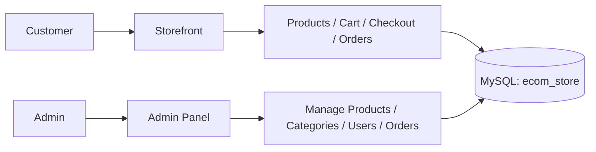

# Laravel E-Commerce — Walkthrough

## What Was Built

A full-featured **ShopVue** e-commerce platform with a customer storefront and admin panel, powered by **Laravel 12**, **MySQL**, and **Bootstrap 5**.

---

## Architecture Overview



---

## Key Files Created

| Layer | Files |
|-------|-------|
| **Migrations** | `categories`, [products](file:///c:/xampp/htdocs/dashboard/E-COM/app/Models/Category.php#11-15), [orders](file:///c:/xampp/htdocs/dashboard/E-COM/app/Models/User.php#40-44), `order_items`, `carts`/`cart_items` + `role` on `users` |
| **Models** | [Category](file:///c:/xampp/htdocs/dashboard/E-COM/app/Models/Category.php#7-16), [Product](file:///c:/xampp/htdocs/dashboard/E-COM/app/Models/Product.php#7-29), [Order](file:///c:/xampp/htdocs/dashboard/E-COM/app/Models/Order.php#7-27), [OrderItem](file:///c:/xampp/htdocs/dashboard/E-COM/app/Models/OrderItem.php#7-25), [Cart](file:///c:/xampp/htdocs/dashboard/E-COM/app/Models/Cart.php#7-28), [CartItem](file:///c:/xampp/htdocs/dashboard/E-COM/app/Models/CartItem.php#7-26) + updated [User](file:///c:/xampp/htdocs/dashboard/E-COM/app/Models/User.php#10-50) |
| **Middleware** | [AdminMiddleware.php](file:///c:/xampp/htdocs/dashboard/E-COM/app/Http/Middleware/AdminMiddleware.php) |
| **Routes** | [web.php](file:///c:/xampp/htdocs/dashboard/E-COM/routes/web.php) — 52 routes |
| **User Controllers** | [HomeController](file:///c:/xampp/htdocs/dashboard/E-COM/app/Http/Controllers/HomeController.php#9-23), [ProductController](file:///c:/xampp/htdocs/dashboard/E-COM/app/Http/Controllers/Admin/ProductController.php#12-100), [CartController](file:///c:/xampp/htdocs/dashboard/E-COM/app/Http/Controllers/CartController.php#10-85), [CheckoutController](file:///c:/xampp/htdocs/dashboard/E-COM/app/Http/Controllers/CheckoutController.php#11-79), [OrderController](file:///c:/xampp/htdocs/dashboard/E-COM/app/Http/Controllers/Admin/OrderController.php#9-34) |
| **Admin Controllers** | `Admin\DashboardController`, `Admin\ProductController`, `Admin\CategoryController`, `Admin\UserController`, `Admin\OrderController` |
| **Layouts** | [store.blade.php](file:///c:/xampp/htdocs/dashboard/E-COM/resources/views/layouts/store.blade.php) (storefront), [admin/layouts/app.blade.php](file:///c:/xampp/htdocs/dashboard/E-COM/resources/views/admin/layouts/app.blade.php) |
| **Seeder** | [DatabaseSeeder.php](file:///c:/xampp/htdocs/dashboard/E-COM/database/seeders/DatabaseSeeder.php) — 2 users, 5 categories, 20 products |

---

## Features

### 👤 Customer Side
- **Registration & Login** — Laravel Breeze with redirects to home
- **Product listing** — filter by category, search, sort (price/name/latest), pagination
- **Product detail** — breadcrumb, large image, stock status, related products
- **Shopping cart** — add/update/remove, quantity controls, session-based for guests
- **Checkout** — shipping address + phone, order placement with DB transaction
- **Order history** — list with status badges, detailed order view

### 🛠 Admin Panel
- **Dashboard** — stat cards (products, orders, customers, revenue), quick actions, recent orders
- **Products CRUD** — create/edit/delete with image upload
- **Categories CRUD** — with protection against deleting categories that have products
- **Users** — list with role toggle (customer ↔ admin)
- **Orders** — view all orders, update status (pending → processing → shipped → delivered)

---

## Test Credentials

| Role | Email | Password |
|------|-------|----------|
| Admin | `admin@ecom.com` | `password` |
| Customer | `user@ecom.com` | `password` |

---

## Verification Results

✅ `php artisan migrate:fresh --seed` — all migrations and seeders ran successfully
✅ `php artisan route:list` — 52 routes registered
✅ Homepage renders with hero, categories, and featured products
✅ Products page renders with filter sidebar and product grid
✅ Admin login works and admin dashboard shows correct stats (20 products, 1 customer)
✅ Fixed Breeze auth redirect from `dashboard` → `home` across all 6 auth controllers

### Browser Recording


---

## How to Run

```bash
# Start the dev server
php artisan serve --port=8080

# Visit http://127.0.0.1:8080
```

The dev server is currently running at **http://127.0.0.1:8080**.
